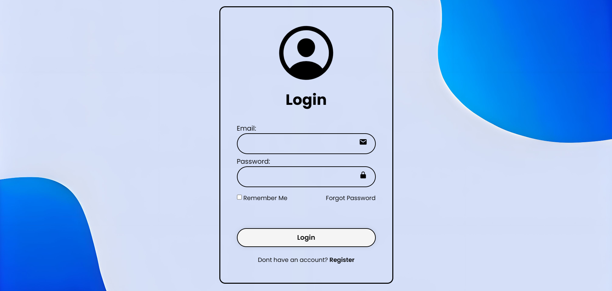

# 📘 DeptXpert Educational ERP System 

**DeptXpert** is a modern, web-based **ERP System** developed as my **Diploma Final Year Project**.  
It helps college departments efficiently manage **students, teachers, and departmental data** – all from one place.  

---

## ✨ Features  

- 🔑 **Secure Multi-Role Login** – Student, Teacher, HOD, Principal  
- 🧑‍🏫 **Teacher Management** – Add, update, and manage teacher data  
- 🎓 **Student Management** – Maintain student profiles, results, and records  
- 🏫 **Department Dashboard** – View and manage departmental details  
- 📚 **Study Materials Upload** – Teachers can upload notes/resources  
- 🎮 **Quiz & Activities** – Interactive learning for students  
- 📊 **Principal Dashboard** – Overview of all departments in one place  

---

## 🖼️ Screenshots  

| **Login Page** | **Principal Dashboard** |  
|---------------|----------------------|  
|  |  |  

| **Student Dashboard** | **Teacher Dashboard** |  
|----------------------|----------------------|  
|  |  |  

---

## 🛠️ Tech Stack  

| Layer | Technology |  
|------|------------|  
| **Frontend** | HTML, CSS, JavaScript, Bootstrap |  
| **Backend** | PHP |  
| **Database** | MySQL (via XAMPP) |  

---

## ⚙️ Installation & Setup  

1. **Install XAMPP** → [Download Here](https://www.apachefriends.org/index.html)  
2. **Copy Project** → Move the `DeptXpert` folder into `htdocs` inside your XAMPP directory  
   - Example: `C:\xampp\htdocs\DeptXpert`  
3. **Start Services** → Open XAMPP Control Panel → Start **Apache** & **MySQL**  
4. **Setup Database**  
   - Go to `phpMyAdmin` → Create a database `deptxpert`  
   - Import `deptxpert.sql` from the project folder  
5. **Run Project**  
   - Open browser → Go to:  
     ```
     http://localhost/DeptXpert/
     ```  

---

## 🚀 Future Enhancements  

- 📌 Online Examination System  
- 📌 Attendance Management  
- 📌 Automated Notifications (Email/SMS)  

---

## 👨‍💻 About  

🎓 *Diploma Final Year Project (2024)*  
👨‍💻 Developed by **Chetan More** & **Team** 
(Sahil Jadhav, Shubham Gaikwad, Shriyash Todkari)  
🔗 [LinkedIn](https://www.linkedin.com/in/chetan-more4596/)
